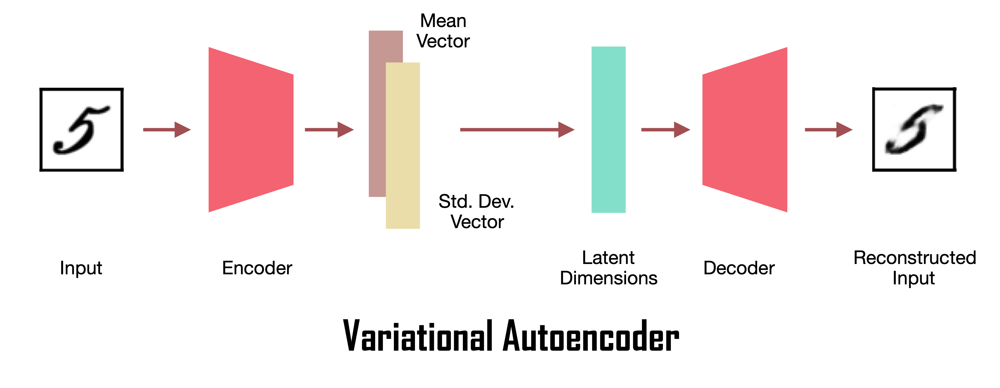
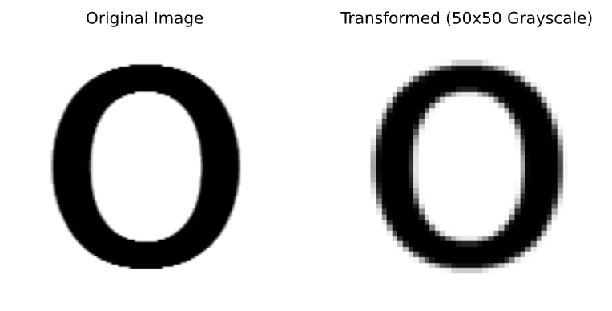
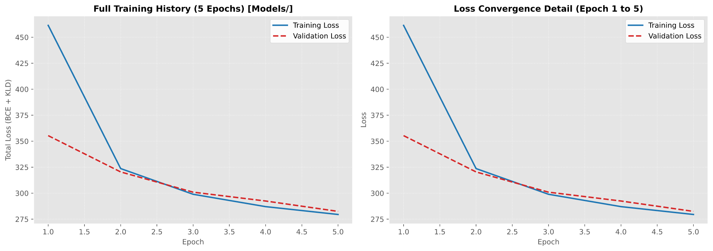
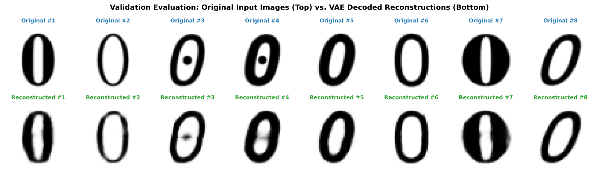
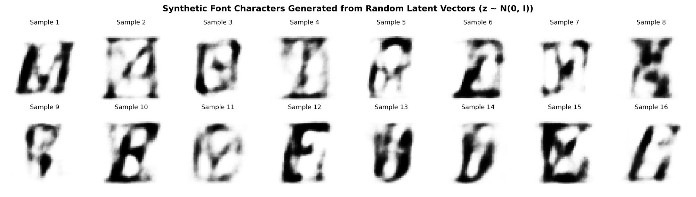
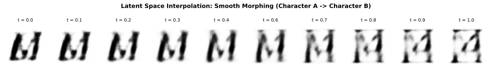

# 🧬 Image Compression & Generation using Variational Autoencoders

<div align="center">
  
</div>

> **PyTorch Implementation** · Character Font & CelebA Synthesis · Deep Generative Modeling

Implementation of **Variational Autoencoders (VAEs)** in PyTorch for high-ratio image compression, generative character synthesis, and continuous latent space interpolation.

---

## 📑 Table of Contents

- [Overview](#overview)
- [Key Concepts](#key-concepts)
- [Architecture](#architecture)
- [Project Structure](#project-structure)
- [Getting Started](#getting-started)
- [Notebook Walkthrough](#notebook-walkthrough)
- [Results](#results)
- [References](#references)
- [License](#license)

---

## Overview

<div align="center">
  
</div>

A **Variational Autoencoder (VAE)** is a probabilistic generative model that learns a smooth, continuous latent representation of data. Unlike standard autoencoders that map inputs to discrete points, VAEs encode inputs as probability distributions, enabling:

- **Image Compression** — A 50×50 grayscale image (2,500 pixels) is compressed into just 32 latent dimensions (~**78× compression**, 98.7% reduction)
- **Generative Synthesis** — Sample random vectors from the latent space to generate brand-new images
- **Latent Space Interpolation** — Smoothly morph between two images by interpolating in latent space

---

## Key Concepts

### Reparameterization Trick

The encoder outputs mean ($\mu$) and log-variance ($\log \sigma^2$) vectors. To enable backpropagation through the stochastic sampling step:

$$z = \mu + \sigma \odot \epsilon, \quad \epsilon \sim \mathcal{N}(0, I)$$

### Loss Function (ELBO)

The VAE optimizes the **Evidence Lower Bound**, composed of two terms:

$$\mathcal{L} = \underbrace{-\sum_{i} \left[ x_i \log \hat{x}_i + (1-x_i)\log(1-\hat{x}_i) \right]}_{\text{Reconstruction Loss (BCE)}} + \underbrace{-\frac{1}{2}\sum_{j}\left(1 + \log\sigma_j^2 - \mu_j^2 - \sigma_j^2\right)}_{\text{KL Divergence}}$$

| Term | Purpose |
|------|---------|
| **BCE** | Measures how accurately the decoder reconstructs the original image |
| **KLD** | Regularizes the latent space to stay close to a standard normal $\mathcal{N}(0, I)$ |

---

## Architecture

| Layer | Dimensions | Activation |
| ------- | ----------- | ------------ |
| **Input** | 2,500 (50×50 flattened) | — |
| **Encoder Hidden** | 2,500 → 1,000 | ReLU |
| **Mean Head** ($\mu$) | 1,000 → 32 | Linear |
| **Log-Var Head** ($\log\sigma^2$) | 1,000 → 32 | Linear |
| **Decoder Hidden** | 32 → 1,000 | ReLU |
| **Output** | 1,000 → 2,500 | Sigmoid |

```
Input (50×50) → Flatten → FC(2500→1000) → ReLU
                                ├── FC(1000→32) → μ
                                └── FC(1000→32) → log σ²
                                         ↓
                              z = μ + σ ⊙ ε  (reparameterization)
                                         ↓
                         FC(32→1000) → ReLU → FC(1000→2500) → Sigmoid → Output (50×50)
```

### Hyperparameters

| Parameter | Value |
| ----------- | ------- |
| Epochs | 1,000 |
| Batch Size | 64 |
| Latent Dimension | 32 |
| Learning Rate | 1e-3 |
| Optimizer | Adam |
| Image Size | 50 × 50 (grayscale) |

---

## Project Structure

```
├── Image_Compression_and_Generation_using_Variational_Autoencoders.ipynb
│                                       # Main notebook with theory, code, and visualizations
├── assets/
│   ├── banner.png                      # Project banner
│   ├── vae.png                         # VAE architecture diagram
│   ├── preprocessing_sample.png        # Input preprocessing (Original vs 50x50 grayscale)
│   ├── training_loss_curves.png        # Loss convergence history
│   ├── reconstruction_comparison.png   # Original vs reconstructed font characters
│   ├── generative_synthesis.png        # Synthetic font generation from latent space
│   └── latent_space_interpolation.png  # Continuous latent space morphing
├── HOW_TO_FONTS.txt                    # Instructions for downloading the Font dataset
├── requirements.txt                    # Python dependencies
├── pyproject.toml                      # Project configuration (uv/pip)
├── main.py                            # Entry point (placeholder)
├── LICENSE                            # MIT License
└── README.md                          # This file
```

### Generated at Runtime

| Directory | Contents |
| ----------- | ---------- |
| `Font/` | Character Font Images dataset (train/val splits) |
| `Models/` | Training checkpoints saved every 50 epochs |
| `Results/` | Reconstruction comparisons and generated samples |
| `Presaved_Models/` | Pre-trained weights (download separately) |
| `Presaved_Results/` | Pre-computed result images (download separately) |
| `Celebs/` | CelebA reconstruction images (download separately) |

---

## Getting Started

### Prerequisites

- Python 3.10+
- [uv](https://docs.astral.sh/uv/) (recommended) or pip

### Installation

```bash
# Clone the repository
git clone https://github.com/mohd-faizy/generative-VAE-pytorch.git
cd generative-VAE-pytorch

# Create virtual environment and install dependencies
uv venv
uv add -r requirements.txt

# Register Jupyter kernel
.venv/Scripts/python -m ipykernel install --user --name "vae-pytorch" --display-name "VAE PyTorch"
```

### Dataset

Download the **Character Font Images** dataset from the Google Drive link provided in [`HOW_TO_FONTS.txt`](HOW_TO_FONTS.txt) and unzip it into the `Font/all/` directory.

### Run the Notebook

1. Open `Image_Compression_and_Generation_using_Variational_Autoencoders.ipynb`
2. Select the **"VAE PyTorch"** kernel
3. Run All Cells

---

## Notebook Walkthrough

| Task | Description |
| ------ | ------------- |
| **Task 1** | Introduction & theoretical background (AE vs VAE, reparameterization, ELBO) |
| **Task 2** | Exploratory data analysis and preprocessing (grayscale, resize to 50×50) |
| **Task 3** | Training/validation split (20 images per class for validation) |
| **Task 4** | Creating PyTorch DataLoaders |
| **Task 5** | VAE architecture definition and model instantiation |
| **Task 6** | Training loop with loss tracking and periodic checkpointing |
| **Task 7** | Results: loss curves, character generation, latent interpolation, CelebA |

<div align="center">
  
  <p><em>Task 2: Input normalization pipeline converting raw font images to 50×50 grayscale tensors</em></p>
</div>

---

## Results

### Training & Loss Convergence

Training across 950 epochs demonstrates steady convergence of both reconstruction loss (BCE) and latent space regularization (KL divergence).

<div align="center">
  
  <p><em>Full 950-epoch loss progression (left) and loss convergence detail (right)</em></p>
</div>

### Character Font Compression (32-D Latent Space)

After training for 950 epochs, the VAE achieves high-fidelity reconstruction of font characters with a **78× compression ratio** (compressing 2,500 pixels into just 32 latent dimensions).

<div align="center">
  
  <p><em>Validation Evaluation: Original input characters (top row) vs. VAE decoded reconstructions from 32-D latent vectors (bottom row)</em></p>
</div>

### Generative Synthesis

Random samples from standard normal latent space $z \sim \mathcal{N}(0, I)$ passed through the decoder produce novel, realistic font characters never seen during training.

<div align="center">
  
  <p><em>Synthetic font characters generated from purely random Gaussian latent vectors</em></p>
</div>

### Latent Space Interpolation

Smoothly morphing between two characters by linearly interpolating in latent space demonstrates the continuity and completeness of the learned representation without holes or collapse.

<div align="center">
  
  <p><em>Smooth latent space traversal morphing from Character A to Character B (t = 0.0 to 1.0)</em></p>
</div>

### CelebA Faces (500-D Latent Space)

The same architecture scales to the CelebA dataset with a 500-dimensional latent space, progressively sharpening face reconstructions over 600 training epochs.

---

## References

- [Blog Post by Jeremy Jordan — Variational Autoencoders](https://www.jeremyjordan.me/variational-autoencoders/)
- [Stanford CS228 — Variational Inference](https://ermongroup.github.io/cs228-notes/inference/variational/)
- [Video Lecture by Arxiv Insights](https://www.youtube.com/watch?v=P78QYjWh5sM)
- [Official PyTorch VAE Example](https://github.com/pytorch/examples/tree/master/vae)
- [Character Font Images Dataset (UCI)](http://archive.ics.uci.edu/ml/datasets/Character+Font+Images)
- [CelebA Dataset](http://mmlab.ie.cuhk.edu.hk/projects/CelebA.html)

---

## License

This project is licensed under the **MIT License** — see the [LICENSE](LICENSE) file for details.

---

## 🔗 Connect with Me

<div align="center">

[](https://twitter.com/F4izy)
[](https://www.linkedin.com/in/mohd-faizy/)
[](https://ai.stackexchange.com/users/36737/faizy)
[](https://github.com/mohd-faizy)

</div>